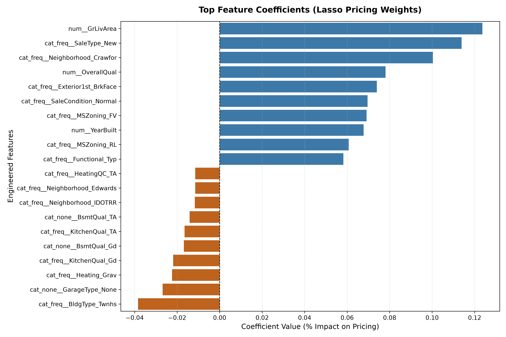
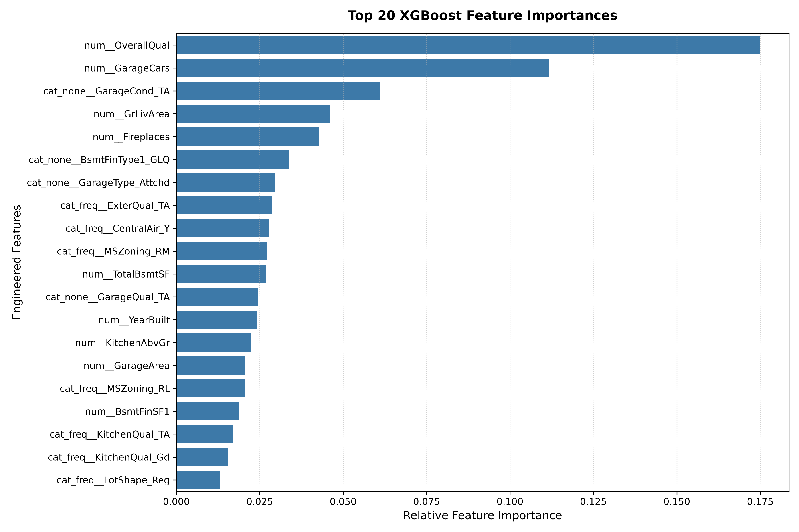

# 🏡 Automated Valuation Model (AVM) for Housing Price Prediction in Ames, Iowa 🏡

## 👔 Executive Summary
This project delivers a production-ready Automated Valuation Model (AVM) built to predict residential home prices in Ames, Iowa. Rather than manually picking variables, the architecture leverages an end-to-end, data-leakage proof Scikit-Learn processing pipeline. The project contrasts a regularized linear framework (`LassoCV`) against an optimized gradient-boosted ensemble (`XGBoost`) to evaluate the structural trade-off between the benefits of extrapolation seen in linear models against the high-dimensional non-linear interactions captured by tree architectures.

The final iteration of the model implements an **Ensemble Blend (70% Lasso / 30% XGBoost)**, which got the highest test score of **0.9317 R²**achieved by blending linear extrapolations with tree-based feature interactions.

---

## 📈 Project Evolution & Iterative Improvements
This document tells the story of how this model evolved from initial manual data manipulation to a production-grade automated architecture and also shares interesting findings along the way:

### 🔹 Phase 1: Manual Exploration, Feature Pruning, & Legacy Linear Modeling
* **Feature Explosion:** During data preparation, converting text categories (e.g. neighborhoods or roof styles) into numbers caused the feature count to explode to 255 variables. This high number risks "overfitting" which is when a model memorizes data patterns too closely and thus fails on new data. To fix this, `LassoCV` was implemented as an automated filter, identifying and dropping 175 noisy features by stripping their influence to exactly zero, leaving us with the 80 most impactful predictors. There was a strong Baseline Performance thanks to this rigorous filtering and the Lasso model scored a 94.4% training accuracy while maintaining a 92.8% testing accuracy on unseen data. This tiny gap of (just 1.6%) between these two scores proved that feature pruning successfully prevented the model from overfitting.
* **Early Anomaly Identification:** Initial `LassoCV` training runs suffered from severe overfitting (Training R²: 0.9004 / Testing R²: 0.8812) due to a combination of high-cardinality categorical outliers and data anomalies that had not been cleaned.

### 🔹 Phase 2: Production Pipeline Automation & Target Skewness
* **Leak-Proof Architecture:** Replaced manual steps with an automated `ColumnTransformer` and `Pipeline` layout, in order to prevent data leakage during validation loops.
* **Target Log-Transformation:** Addressed heavy right-skewness in the target variable (`SalePrice`) by wrapping regressors in Scikit-Learn's `TransformedTargetRegressor`. Also, applied an internal log-transform (`np.log1p`) which stabilized residual variance (homoscedasticity) and prevented multi-million dollar luxury outliers from dominating the Ordinary Least Squares (OLS) loss function.

### 🔹 Phase 3: Capturing Complex Patterns with XGBoost and Stategic Imputation
* **Capturing Non-Linear Interactions:** While Lasso exceled at finding simple, linear relationships, real estate pricing often involves complex, compounding factors (like a large garage combined with a specific neighborhood). Therefore XGBoost, a powerful tree-based algorithm, was introduced to evaluate all 255 features and capture these hidden interactions. XGBoost pushed the raw training accuracy to 97.5% and hit 91.8% testing accuracy.
* **Domain-Driven Imputation:** Identified that the standard `most_frequent` categorical imputation introduced structural data bias (e.g., transforming 1,400 homes without a pool into homes with an "Average" pool quality). Thus, created a dual-categorical preprocessing transformer that routes structural missingness (e.g., `PoolQC`, `GarageType` where NaN means "None") to a constant filler while maintaining frequency rules for random/rare missing data.

### 🔹 Phase 4: Ensemble Blending (Current Framework)

* **Algorithmic Blending:** Developed an Ensemble Blend weighting Lasso at 70% and XGBoost at 30%. This allowed Lasso to serve as a stable extrapolation anchor across the macro dataset while allowing XGBoost to cleanly capture non-linear local interactions (e.g., how the size of a garage interacts conditionally with its quality status).  The 70/30 blended ensemble was the winning combination since it combined the stable, streamlined logic of Lasso (70% weight) with the high-octane pattern recognition of XGBoost (30% weight). This team-up got the best of both worlds and outperformed both individual models, delivering the highest overall testing accuracy of 93.2% while still keeping the model highly stable and reliable on new data.

---

## 📊 Final Model Performance Audit

The transformation of the data pool, strategic categorical imputation, and hyperparameter tuning yielded the final audited metrics below:

| Model Framework | Training R² | Testing R² | Generalization Delta | Key Production Behavior |
| :--- | :---: | :---: | :---: | :--- |
| **LassoCV Regression** | 0.9438 | **0.9280** | **0.0158** | **Highly Robust.** Automatically dropped 175 noisy dimensions. |
| **Tuned XGBoost** | 0.9753 | **0.9178** | **0.0576** | **High Capacity.** Responded to grid expansions; caps at extreme values. |
| 🚀 **Ensemble Blend (70/30)** | 0.9583 | **0.9317** | **0.0267** | **Production Winner.** Perfect blend of linear stability & local interaction. |

---

### 🔍 Core Engineering Insight: Linear Extrapolation vs. Tree Interaction
While standalone **XGBoost** achieved a dominant Training R² of **0.9753**, its Testing R² was only **0.9178**. Because tree-based ensembles predict values based on leaf-node averaging, they inherently cannot extrapolate beyond the maximum feature boundaries present in their training dataset. 

Conversely, the **LassoCV** model showcased elite generalization capabilities (\(\Delta = 0.0158\)). Lasso’s continuous linear slope provided mathematical extrapolation essential for high-leverage production environments. Therefore, by combining them into a final 70/30 blend, the AVM essentially captured deep localized "AND" interactions via XGBoost (e.g., `num__GarageCars` \(\times\) `cat_none__GarageCond_TA`) without sacrificing the robust stability of the Lasso baseline model.

---

## 🚀 Key Business Insights & Model Discoveries
The processing pipeline automatically extracts visualization assets to compare log-space linear pricing weights against non-linear relative importance scales.

<p align="center">
  
  
</p>

### 1. Lasso Log-Space Coefficients (Top Multiplicative Drivers)
Because the target is log-transformed, Lasso's coefficients represent relative percentage multipliers (\(e^{\beta} - 1\)) rather than flat dollar values. Out of the 255 evaluated features, Lasso zeroed out 175 unimpactful attributes, locking onto the true underlying financial signals:
* **Top Spatial Premium (`num__GrLivArea`):** Drives a continuous baseline log premium of **+0.1237** per unit scale increase.
* **Top Positional Premium (`cat_freq__Neighborhood_Crawfor`):** Houses in the Crawford neighborhood enjoy an approximate **+10.5%** structural value multiplier over the baseline intercept.
* **Top Property Discount (`cat_freq__BldgType_Twnhs`):** Townhouses experience a structural value penalty of roughly **-3.8%** relative to detached single-family homes.

### 2. XGBoost Relative Feature Importances
Unlike Lasso's absolute directional weights, XGBoost evaluates structural split information utility (Information Gain) across its 300 sequential trees:
* **Primary Information Gain (`num__OverallQual`):** Captures **17.49%** of total predictive split power, followed tightly by structural spatial markers like `num__GarageCars` (**11.16%**) and functional qualitative checkpoints like `cat_none__GarageCond_TA` (**6.09%**).

---

## 🛠️ Data Audits & Outlier Mitigations

### 📐 The Ground Living Area Anomaly (`GrLivArea`)
* **The Audit:** Deep exploratory analysis revealed massive physical properties (meaning > 4,000 sq ft) with highly depressed sales figures, destroying standard linear trajectories.
* **The Fix:** The pipeline implements a strict filtering constraint (`GrLivArea < 4000`) to isolate extreme mathematical anomalies. Removing these exceptions allowed the linear model to cleanly generalize to standard residential assets, driving the baseline test scores up.

### 🧱 The Clay Tile Roof Anomaly (`RoofMatl_ClyTile`)
* **The Audit:** Standard model evaluations initially flagged an extreme, distorted negative coefficient for properties with Clay Tile Roofs. A deep data audit revealed that the entire dataset contained only a single property with this feature which was a luxury home that suffered catastrophic structural damage, resulting in a heavily suppressed litigation sale that heavily biased linear weights.
* **The Fix:** The data cleaning process drops this single-property, sparse category. Dropping this anomaly removed artificial training inflation, directly restoring the macro pricing rules.

---

## ⚙️ Technical Architecture & Pipeline Design
The software is engineered following modular production standards, utilizing isolated pipelines to completely eliminate **data leakage** during cross-validation loops.

```text
Raw Data ➔ ColumnTransformer (Strategic Imputation) ➔ Scaler / OneHotEncoder ➔ TransformedTargetRegressor (np.log1p) ➔ GridSearchCV Ensemble
```

* **Encapsulation & Modularity:** By embedding the log-transform wrapper (`TransformedTargetRegressor`) directly inside the pipeline step, the entire data cleaning, scaling, encoding, and inference logic are bound together as a single Python artifact. This completely guarantees that testing metrics and downstream application endpoints receive predictions automatically mapped back to raw real-world dollar amounts via `np.expm1`.
* **Built-in Resilience Against "Unknown Categories":** When rare, low-cardinality categorical attributes are sequestered strictly inside a test split, the encoder gracefully maps these un-encountered dimensions to an all-zero matrix via `handle_unknown='ignore'`. This preserves structural dimension alignment ($N=255$) and ensures robust error handling in production environments.
* **Hyperparameter Optimization:** Grid search cross-validation optimized the XGBoost ensemble across a 3-fold cross-validation architecture over R² evaluation metrics, yielding an optimal learning rate of `0.05`, a `max_depth` of `3` to suppress spurious splits, `300` sequential estimators, and a `subsample` rate of `0.8` to actively penalize model variance.

---

## 📁 Repository Structure
* `main.py`: Main execution script to trigger data processing, model training, and metrics export.
* `src/pipeline.py`: Production-grade Scikit-Learn `ColumnTransformer` and pipeline components.
* `src/evaluation.py`: Modules for extracting coefficients, feature weights, and residual evaluations.
* `outputs/`: Automatically exported diagnostic and performance visualizations.

## 💻 How to Run
To reproduce the model pipeline and view diagnostic metrics locally:
```bash
# 1. Install dependencies:
pip install -r requirements.txt

# 2. Run the pipeline:
python main.py
```

---

## 📁 Repository Structure
* `main.py`: Main execution script to trigger data processing, model training, and metrics export.
* `src/pipeline.py`: Production-grade Scikit-Learn `ColumnTransformer` and pipeline components.
* `src/evaluation.py`: Modules for extracting coefficients, feature weights, and residual evaluations.
* `outputs/`: Automatically exported diagnostic and performance visualizations.

## 💻 How to Run
To reproduce the model pipeline and view diagnostic metrics locally:
```bash
# 1. Install dependencies:
pip install -r requirements.txt

# 2. Run the pipeline:
python main.py
```

---

## 🪵 Production Log Output (Verbatim Execution)
Below is the exact output from the unified evaluation pipeline, documenting the performance breakthrough achieved by the **Ensemble Blend**:


<details>
<summary><b>Click to expand live execution log output</b></summary>
    
```text
Loading and preparing Ames Housing dataset...

--- Running Baseline LassoCV Model ---
=========================================
       MODEL PERFORMANCE AUDIT           
=========================================
Training R² Score: 0.9438
Testing R² Score:  0.9280
Generalization Delta: 0.0158
Optimal Alpha Selected by CV: 0.0007
Total Dimensions Evaluated:   255
Dimensions Kept by Lasso:     80
Dimensions Dropped (Zeroed):  175
=========================================

--- TOP 5 ASSET PREMIUM DRIVERS ---
                       Feature  Coefficient
                num__GrLivArea     0.123681
        cat_freq__SaleType_New     0.113892
cat_freq__Neighborhood_Crawfor     0.100340
              num__OverallQual     0.078053
 cat_freq__Exterior1st_BrkFace     0.073956

--- TOP 5 ASSET DISCOUNT DRIVERS ---
                  Feature  Coefficient
 cat_freq__BldgType_Twnhs    -0.038426
cat_none__GarageType_None    -0.026877
   cat_freq__Heating_Grav    -0.022385
 cat_freq__KitchenQual_Gd    -0.021853
    cat_none__BsmtQual_Gd    -0.016866

-----------------------------------------

--- Running Hyperparameter-Tuned XGBoost Model ---
=========================================
       MODEL PERFORMANCE AUDIT           
=========================================
Training R² Score: 0.9753
Testing R² Score:  0.9178
Generalization Delta: 0.0576
Total Features Evaluated by XGB: 255
=========================================

--- TOP 10 XGBOOST PREDICTIVE DRIVERS ---
                    Feature  Importance
           num__OverallQual    0.174869
            num__GarageCars    0.111606
    cat_none__GarageCond_TA    0.060863
             num__GrLivArea    0.046213
            num__Fireplaces    0.042891
 cat_none__BsmtFinType1_GLQ    0.033854
cat_none__GarageType_Attchd    0.029465
     cat_freq__ExterQual_TA    0.028769
     cat_freq__CentralAir_Y    0.027718
      cat_freq__MSZoning_RM    0.027221

-----------------------------------------

--- Running Ensemble Blend (70% Lasso / 30% XGBoost) ---
=========================================
       ENSEMBLE PERFORMANCE AUDIT        
=========================================
Ensemble Training R² Score: 0.9583
Ensemble Testing R² Score:  0.9317
Ensemble Generalization Delta: 0.0267
=========================================
```

</details>

---

## 🔮 Future Architecture Roadmap
Finally to make further improvments on this model, the next development cycles will focus on:

* **ElasticNet Transition:** Replace the pure `LassoCV` baseline with an optimized `ElasticNetCV` pipeline. This will allow the architecture to leverage both L1 (Lasso) and L2 (Ridge) regularization simultaneously, balancing Lasso's aggressive feature elimination with Ridge’s ability to handle highly correlated multicollinear features smoothly.
* **Hyperparameter Ensemble Expansion:** Expand the current grid search footprint to tune alternative tree-based architectures, specifically evaluating `LightGBM` to compare memory efficiency against the `XGBoost` baseline.
* **Automated Inference API:** Wrap the final `Pipeline` artifact inside a lightweight `FastAPI` endpoint to simulate production deployment and real-time inference latency audits.
